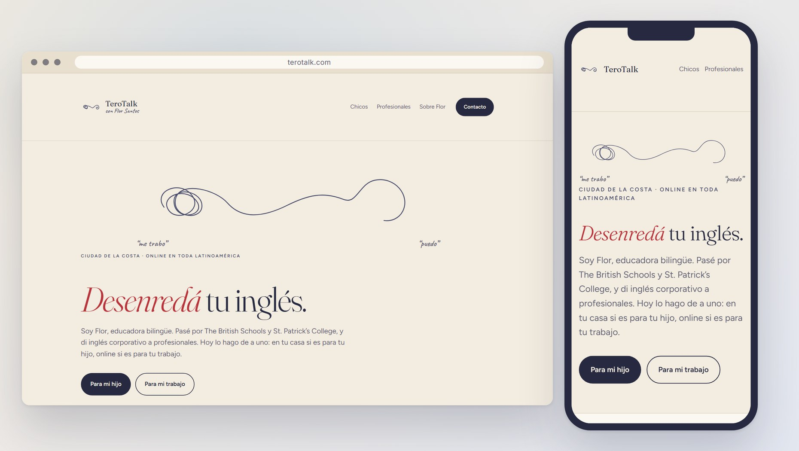

  

### Untangle your English.

An IB-trained teacher in Ciudad de la Costa, Uruguay. 
In-home lessons for kids, and a six-hour online program for working professionals.

---

---

## The brief

Flor teaches; TeroTalk is only the name over the door, and the site was built so the name never gets in front of the person. The two services stay apart on purpose, because the parent who is tired of driving a kid across town and the professional who freezes in an English meeting are not the same person and cannot be told the same thing. Nothing here asks for a form or a password. Every path ends where the work actually starts: a message to Flor.

## Under the hood

Three static pages, one per audience, with a home that splits between them. HTML and three stylesheets, no build step and no dependencies. Every push to `main` is checked before it ships, and a check that fails leaves the live site exactly as it was.

Design tokens, conventions and open work: [CLAUDE.md](CLAUDE.md).

## Requirements

- A text editor. There is no build step and nothing to install.
- Python 3, to run `.github/scripts/check.py` before pushing.
- A GitHub account with Pages enabled, to publish.

## License

[MIT](LICENSE) &copy; [Luis Barral](https://barral.dev). Free to use and adapt, as long as the credit stays.

The brand, the copy and the photography belong to the client and are not covered by it.

**[Luis Barral](https://barral.dev)** &middot; MIT License

co-assisted by <b>Claude Opus 5</b>

